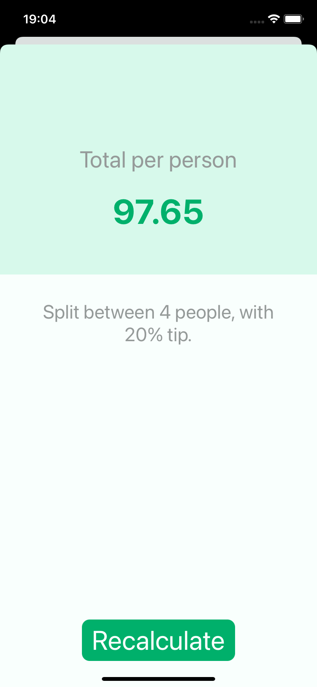

# Tipsy

## Descrição do projeto

Projeto de estudo do curso _iOS & Swift - The Complete iOS App Development Bootcamp_ com a finalidade de criar um aplicativo nativo iOS de divisão de conta com porcentagem de gorjeta.

## Conhecimentos reforçados

- Aplicativos com mais de uma tela com segues
- Utilização de stepper

## Aplicação

